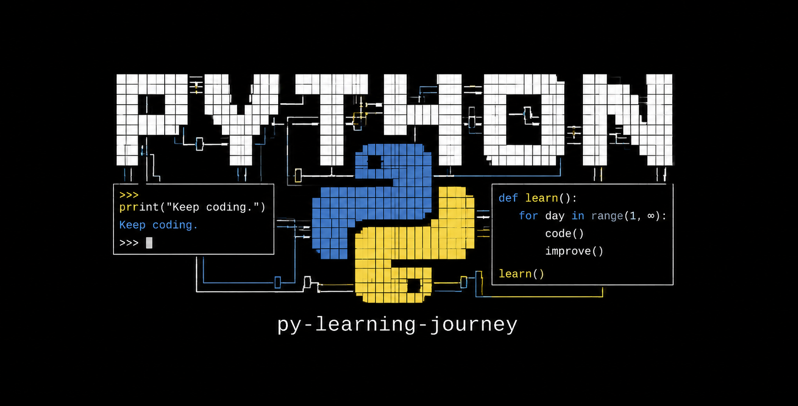

# Offensive Python Journey

> Mi bitácora aprendiendo Python desde cero, con enfoque en hacking ofensivo, automatización, seguridad ofensiva y mentalidad Red Team.



----------

### Sobre este repositorio

Este repo no es un curso copiado ni una colección random de scripts.

Es mi camino aprendiendo Python de verdad:

-   entendiendo lógica
-   rompiendo errores
-   automatizando cosas
-   escribiendo código cada vez más limpio
-   y preparando las bases para seguridad ofensiva y Red Team.

Acá documento ejercicios, conceptos, soluciones y aprendizajes mientras avanzo desde fundamentos hasta herramientas ofensivas más serias.

----------

### Objetivo

Construir una base sólida en Python aplicada a:

-   scripting ofensivo
-   automatización
-   networking
-   parsing
-   manejo de archivos
-   concurrencia
-   explotación
-   tooling para pentesting
-   desarrollo de herramientas propias

La idea no es solo aprender Python.

La idea es pensar como alguien que construye herramientas.

----------

### Estructura del repo

```
Conceptos/
│
├── Funciones/
├── Generadores/
├── Control_Flujo/
├── Excepciones/
├── Colecciones/
├── Strings/
└── Algoritmos/
```

Cada carpeta contiene ejercicios, ejemplos y documentación relacionados con un concepto específico de Python.

El objetivo es aprender los fundamentos del lenguaje de forma progresiva, entendiendo cómo funciona cada pieza antes de aplicarla en automatización, scripting y seguridad ofensiva.

----------

### 📚 Conceptos disponibles

Categoría

[Funciones](Conceptos/Funciones/)
[Generadores](Conceptos/Generadores/)
[Control de Flujo](Conceptos/Control_Flujo/)
[Excepciones](Conceptos/Excepciones/)
[Colecciones](Conceptos/Colecciones/)
[Strings](Conceptos/Strings/)
[Algoritmos](Conceptos/Algoritmos/)

----------

### Filosofía del repo

```
while True:

    aprender()
    romper_codigo()
    entender_errores()
    mejorar_logica()
    construir_herramientas()

    if copiar_y_pegar:
        continue

    if entender_problema:
        evolucionar()
```

----------

### Cómo usar este repo

1.  Escoge un concepto
2.  Explora los ejercicios disponibles
3.  Intenta resolver los problemas por tu cuenta
4.  Compara enfoques
5.  Rompe el código
6.  Modifícalo
7.  Mejóralo

----------

### Mentalidad

> “Aprender a programar no es aprender sintaxis.  
> Es aprender a resolver problemas.”

----------

### Notas

Si también estás aprendiendo Python:

-   explora los conceptos
-   modifica los ejercicios
-   rompe el código
-   vuelve a construirlo

Ahí es donde realmente empiezas a entender.
